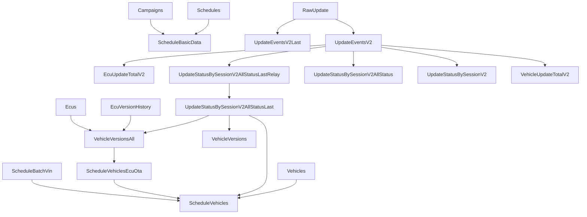
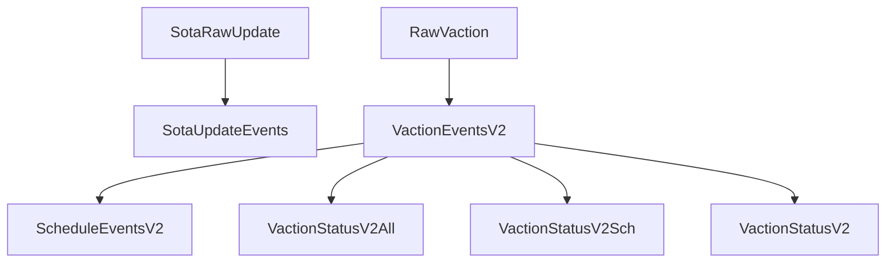

# 奇瑞流程图整理

```
整理范围 jobs/$db.transform + jobs/$db.transformbyid 
```

### 流程图1


```mermaid
graph TD;
    %% $db.transform/cases
    Campaigns-->ScheduleBasicData;
    Ecus-->VehicleVersionsAll;
    EcuVersionHistory-->VehicleVersionsAll;
    ScheduleBatchVin-->ScheduleVehicles;
    Schedules-->ScheduleBasicData;
    ScheduleVehiclesEcuOta-->ScheduleVehicles;
    UpdateStatusBySessionV2AllStatusLast-->ScheduleVehicles;
    UpdateStatusBySessionV2AllStatusLast-->VehicleVersionsAll;
    Vehicles-->ScheduleVehicles;
    VehicleVersionsAll-->ScheduleVehiclesEcuOta;
  
    %% $db.transformbyid/cases
    RawUpdate-->UpdateEventsV2Last;
    RawUpdate-->UpdateEventsV2;
  
    UpdateEventsV2-->EcuUpdateTotalV2;

    UpdateEventsV2-->UpdateStatusBySessionV2AllStatusLastRelay
    UpdateEventsV2-->UpdateStatusBySessionV2AllStatus
    UpdateEventsV2-->UpdateStatusBySessionV2
    UpdateEventsV2-->VehicleUpdateTotalV2
    UpdateStatusBySessionV2AllStatusLastRelay-->UpdateStatusBySessionV2AllStatusLast
    UpdateStatusBySessionV2AllStatusLast-->VehicleVersions
```

### 流程图2


```mermaid
graph TD;

SotaRawUpdate-->SotaUpdateEvents;
RawVaction-->VactionEventsV2;
VactionEventsV2-->ScheduleEventsV2
VactionEventsV2-->VactionStatusV2All
VactionEventsV2-->VactionStatusV2Sch
VactionEventsV2-->VactionStatusV2
```
